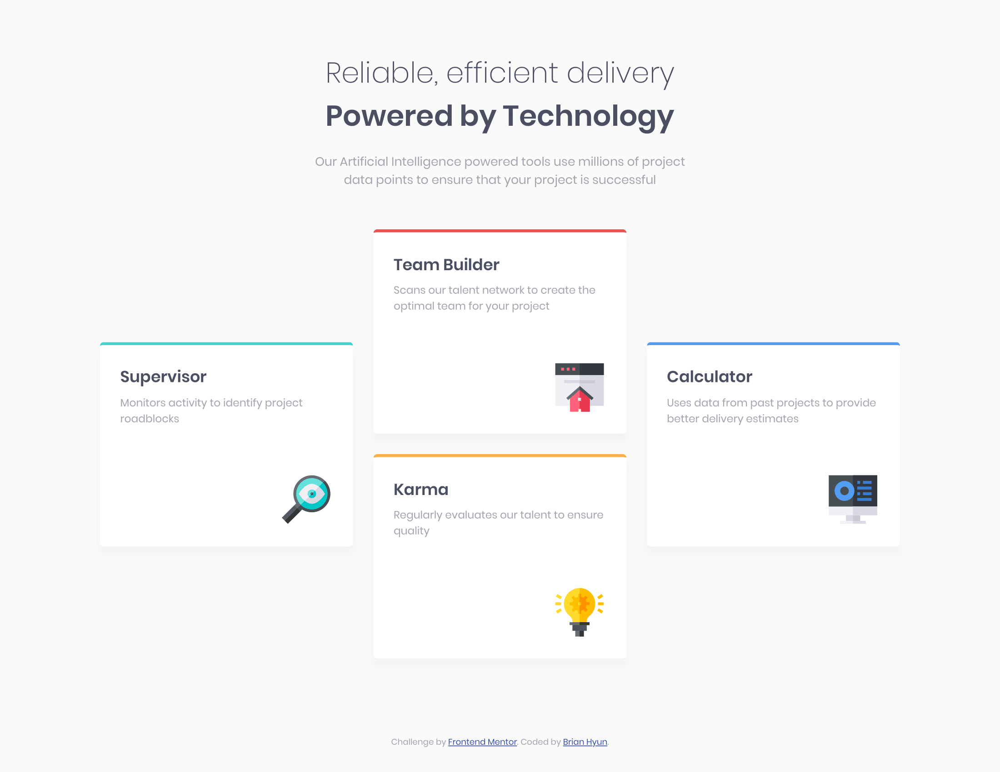
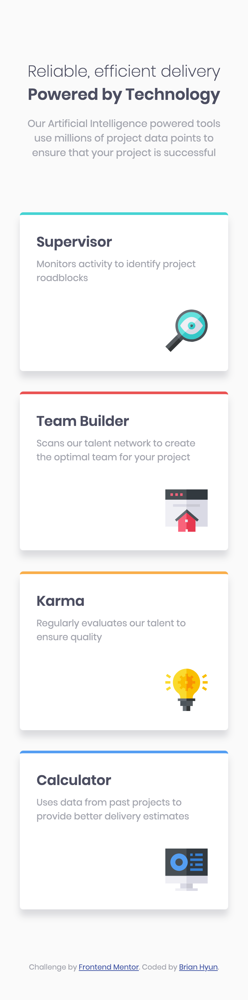

# Frontend Mentor Challenge - HTML/CSS
## Four Card Feature Section

[Link to Completed Web Page](https://brianhyun.github.io/frontend-mentor-four-card-feature-section-challenge
/)

The challenge was to recreate the web page as presented in the design file provided by Frontend Mentor.

### Frontend Mentor Reference Screenshot - Desktop

### Frontend Mentor Reference Screenshot - Mobile 

### Personal Screenshot - Desktop

### Personal Screenshot - Mobile

